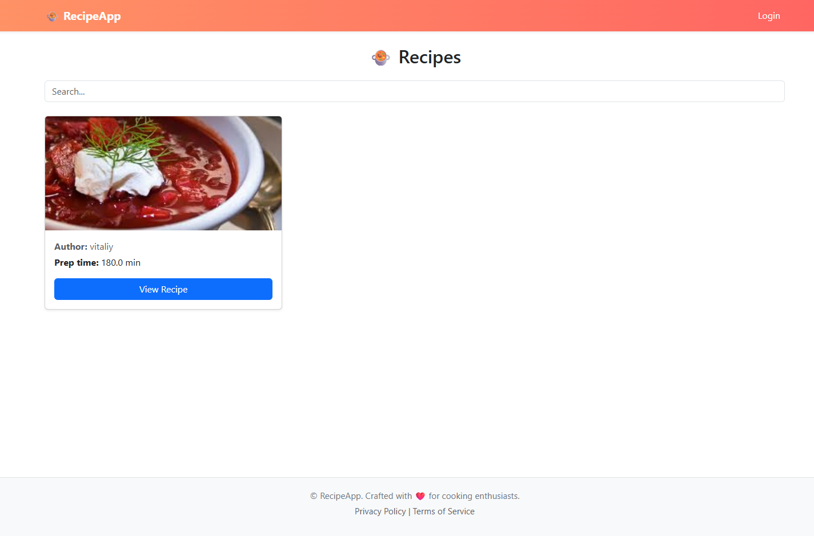
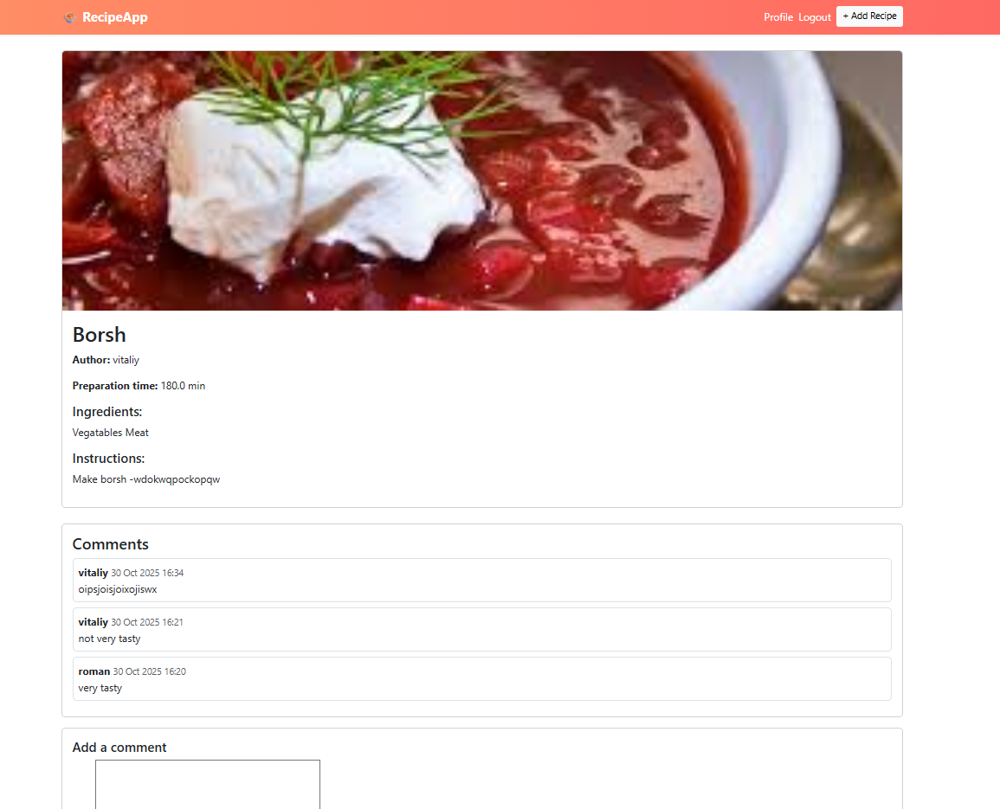

# RecipeApp - Django Project

## Project Description

RecipeApp is a web application developed using Python and Django that allows users to share recipes, leave comments, and discuss dishes. The application features recipes with images, instructions, and a list of ingredients. Each recipe includes information about preparation time and the author.

The app supports a user registration and login system, as well as role assignment, including the administrator role. The data is stored in an SQLite database.

## Project Features

- **User Registration and Authentication**: Users can create accounts and log in to the system.
- **Role System**: There are two roles — regular users and administrators. The administrator has access to the admin panel to manage recipes and users.
- **Add and Comment on Recipes**: Users can add new recipes with a title, ingredients, instructions, and preparation time. They can also leave comments on recipes.
- **Comment System**: Each recipe supports a comment system where users can share their feedback.
- **SQLite Database for Data Storage**: All user, recipe, and comment data is stored in an SQLite database.

## Project Structure

1. **Home Page**: The homepage displays a list of recipes. Each recipe includes:
   - Title
   - Author
   - Preparation time
   - Ingredients
   - Instructions
   - User comments

2. **Add Recipe**: Users can add new recipes by providing a title, ingredients, instructions, and preparation time.

3. **Comments**: Each recipe supports a comment system where users can leave feedback on the recipe.

4. **Accounts and Roles**: Users can create accounts. Administrators can manage users and recipes via the Django admin panel.

## Database Schema

1. **User**: The standard Django user model with additional fields for roles.
2. **Recipe**: A model for recipes that includes fields for title, description, ingredients, instructions, and preparation time.
3. **Comment**: A model for comments, linked to specific recipes.
